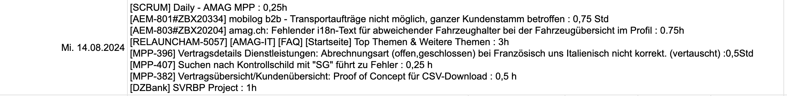

## Inhalt

## Was ist Time Copy?

Time Copy ist eine Browser-Erweiterung, welche dazu gedacht ist, Tabellen Daten
in verschiedene Webanwendungen zu übertragen.
Sie ist also als eine art "Copy-Paste" Erweiterung, nur dass sie die Daten intelligent 
eintragen und zuordnen kann.
Die Extension wurde auf Wunsch kleiner Personen-Gruppen speziell zum Buchen bzw. übertragen von Tabelleninformationen in bestimmten Portalen entwickelt.

Jedoch kann diese durch DLCs erweitert / so modifiziert werden, dass sie "universeller"
einsetzbar ist.
Dennoch ist Time Copy nicht für die Veröffentlichung an die breite Masse gedacht.

Bei weiteren Fragen, Wünschen oder anderen Anregungen, steht eine Kontakt-Email zur verfügung, welche sowohl hier als auch im Readme verlinkt ist.

## How to

### Extension installieren / Deinstallieren (Chrome / Brave Browser)

#### Aus Chrome Store

**_DOWNLOAD:_** https://chromewebstore.google.com/detail/time-copy/gdjoddopmbcdgginieddfecabkhfidbf

Dies ist die kürzeste, schnellste, sicherste und auch allgemein die gängigste art,
eine Extension zu installieren.

- Gehe über den folgenden link in den Chrome-Store und klicke auf den Hinzufügen-Button
- Die Extension wird automatisch runtergeladen und installiert
- Pinne diese am Besten in deiner Chrome-Leiste an, damit du sie per One-Click bzw. Shortcut
  besser erreichen kannst

> [!NOTE]  
> Du kannst die Extension nur über die URL erreichen, da diese im Chrome-Web-Store als "nicht gelistet" steht.
> Sie ist also von außen nicht oder nur schwer auffindbar.

##### Deaktivieren

- Die Extension deaktivierst du, in dem du in die Chrome Extension-Einstellungen (Chrome: chrome://extensions/) wechselst und dort in der entsprechenden Kachel, unten rechts den Switch ausschaltest

##### Deinstallieren
  
- Die Extension deinstallierst du, in dem du in die Chrome Extension-Einstellungen (Chrome: chrome://extensions/) wechselst und dort in der entsprechenden Kachel, unten auf dem Button "Entfernen" klickst

##### Updates

Chrome-Extensions updaten sich immer automatisch, sobald ein neues Release veröffentlicht wurde.
Das Gleiche gilt natürlich auch für Time Copy, wenn du es als "offizielle Version" über den Chrome-Store heruntergeladen hast.
In allen anderen Varianten musst du das Update manuell ziehen

#### Als Build (Zip File)

**_Links:_** https://github.com/SteveTheMusician/TimeCopy?tab=readme-ov-file#time-copy-chrome-extension-builds-compiled-code-als-zip

Die Build-Versionen kannst du nur hier "manuell" über das Readme oder dem entsprechenden Ordner in Git herunterladen.
Der Inhalt ist immer das zusammengebaute Projekt, welches so an den Chrome-Webstore eingereicht wurde.

>[!WARNING]
>Bitte stelle sicher, dass du diese Dateien nur von dem originalem Git-Projekt herunter geladen hast, damit du auf der sicheren Seite bist!
>

- Lade dir die gewünschte Version herunter
- Zip an einem beliebigen Ort entpacken
- Chrome oder Brave-Browser öffnen und in die Extension-Einstellungen navigieren.  (chrome://extensions/)
- In der oberen rechte Ecke den "Entwicklermodus" für Extensions aktivieren.
  Dies erlaubt den Browser unverpackte Programme zu laden (Wie unseres hier)
- Klicke nun oben links auf dem Button "Enpackte Erweiterung Laden"
- Navigiere zu deiner Entpackten Time-Copy Extension
- Beachte, dass du in den Ordner, in den alle Dateien (wie z.B. die mainfest.json) enthalten sind, hinein navigierst.
- Die Extension erscheint nun als in deiner Liste

##### Deaktivieren
- (Identisch mit "Aus Chrome Store installieren/Deaktivieren")

##### Deinstallieren
- (Identisch mit "Aus Chrome Store installieren/Deinstallieren")

##### Updates

In dieser Variante sind keine Updates möglich, da die Extension weder an den Chrome-Store noch an einer Git-Repo gebunden ist.

Die einzige Möglichkeit auf diesem Weg eine neue Version zu erhalten ist, eine neue Build-Zip herunterzuladen, zu entpacken und diese dann in Chrome (wie oben beschrieben) zu laden.

#### Als Git-Projekt

Der Vorteil, die Extension als Git-Projekt zu importieren liegt darin, dass der Benutzer in jeden beliebigen Branch auschecken und so jede Version testen / benutzen kann.
Auch kann er den aktuellsten develop ausprobieren, welcher natürlich so für andere nicht zugänglich ist. 
Nachteil ist, dass es natürlich ein bisschen Programmierkenntnisse und eine Entwickler-Umgebung erfordert.

>[!WARNING]
>Der Develop-Branch sollte nur mit Vorsicht ausgeführt werden.
>Empfohlen ist der Test-Branch oder einer der Releases.

- Installiere  [Node Version 20.11.0 (Weit unten)](https://nodejs.org/en/blog/release/v20.11.0) auf deinen Rechner
- Wenn du mehrere Node-Versionen hast, benutze eine Change-Applikation wie [nvm](https://github.com/nvm-sh/nvm)
- Clone das Projekt über das Terminal oder deiner IDE auf deinen Rechner
  Für mehr details, schaue hier: [How to Git Clone](https://docs.github.com/en/repositories/creating-and-managing-repositories/cloning-a-repository)
- Öffne eine Console / Terminal deiner Wahl und navigiere in das geklonte Projekt.
- Führe hier den Befehl "npm i" aus.
- Benutze "npm run build" um das Projekt zu bauen.
- Der Build erstellt einen Ordner mit dem Namen "dist", welches in Chrome importiert werden kann.
- Drücke "Strg+c" am ende des Builds, um den Prozess wieder zu beenden
- Wechsle in Chrome oder dem Brave Browser in die Erweiterungseinstellungen (chrome://extensions/)
- Schalte oben rechts den Switch "Entwicklermodus" an.
- Klicke oben links auf dem Button "Entpackte Erweiterung laden"
- Navigiere in dein geklontes Time Copy-Projekt und dort in den "dist"-Ordner.
- Die Erweiterung sollte nach dem Bestätigen als kleine Kachel in Chrome erscheinen.

>[!TIP]
>Wenn du mit dem Projekt arbeiten möchtest, kannst du den Build Prozess einfach aktiv lassen.(npm run build ausführen, ohne danach diesen mit strg+c abzubrechen)
>Dieser führt zusätzlich einen Watcher aus, der alle deine Änderungen automatisch in den "dist"-Ordner überträgt.
>
>Um Änderungen in der Extension wirksam zu machen, musst du diese kurz schließen und wieder auf machen. (Z.B. über den Shortcut Srtg+b (cmd+b auf macOS))

>[!IMPORTANT]
>Bei der Installation der NPM-Packages kann es zu **vulnerabilities** kommen.
>Diese dann einfach mit der empfohlenen Node-Version über **"npm audit fix"** beseitigen

##### Deaktivieren
- (Identisch mit "Aus Chrome Store installieren/Deaktivieren")

##### Deinstallieren
- (Identisch mit "Aus Chrome Store installieren/Deinstallieren")
- Das Git Projekt kannst du zudem ganz normal über den Finder / Explorer löschen

##### Updates

Die Extension bekommt "automatisch" keine Updates wie eine fertige Chrome-Extension.
Du kannst allerdings diese dir immer relativ schnell ziehen, in dem per Terminal in dein Git-Projekt wechselst und dort den Befehl "git pull" ausführst.

>[!IMPORTANT]
>Beachte, dass für Git-Pull natürlich Änderungen vom Entwickler gegeben sein müssen.
>Aktuelle Änderungen sind nur in den Branches "develop" oder "Test-Release" zu erwarten.
>In allen anderen kommen Updates nur zum Release. (Auf Version achten)

### Time Copy Benutzen

#### Allgemeine Benutzung

- Kopiere deine Daten aus einer beliebigen Excel Tabelle
- Öffne die Webseite, auf der du die Informationen übertragen willst
- Öffne Time Copy und klicke auf das Einfügen-Icon
- Wenn alles Fertig ist, wird dich Time Copy benachrichtigen

>[!IMPORTANT]
>Die aktuellen DLCs unterstützen keine CSV Formate.
>Buchungs-Daten kännen nur von einem einzelnen Ticket bis zu maximal einen Tag kopiert werden.
>(Stand 19.02.2025)

#### Erweiterte Benutzung

##### Einstellen

Damit Time Copy so funktioniert, wie du es möchtest, musst du zu erst Einstellungen vornehmen.
Alle Einstellungen findest du unter dem Zahnrad-Icon.

1) Filter einstellen:
Filter werden als DLCs (kleine Erweiterungen) mitgeliefert.
Sie erkennen und verarbeiten die Daten, die du in dein Clipboard kopierst und geben sie an das Platform DLC weiter.
Du findest sie unter dem Filter-Icon (zweiter Tab von oben).

Wähle aus, welches Format du zum kopieren deiner Daten verwendest.

>[!NOTE]
>Filter werden erst aktiv, sobald du auf Einfügen klickst.
>Deine Daten aus dem Clipboard werden also erst dann ausgelesen und nicht vorher.

2) Erkennung erstellen:
Erkennuns-Parameter werden von Time Copy dazu benutzt, die Daten, die von den Filter kommen,
einer Buchungsplatform zu zu ordnen.
Du findest sie unter dem Auge-Icon (drittes Symbol von oben)

- Klicke auf das "+" um eine neue Erkennung hinzuzufügen
- Wähle im Select-Dropdown deine Erkennung aus.
- Fülle die gewünschten Werte in der Erkennung aus
- Änderungen speicherst du durch ein klick auf den Zurück-Pfeil oben links

> [!NOTE]  
> Die Eingaben eines Erkennungsitem hängen von den vorhandenen Platformen ab

3) Buchungsplatform wählen
Buchungsplatformen sind Webseiten, in denen deine verarbeitete Daten automatisch eingetragen werden sollen.
Die Optionen findest du unter dem Kalender-Icon (viertes von oben).
Du kanst entweder eine Auswählen, die dann immer benutzt wird, oder du wählst "Automatisch", welche dann je 
nach Webseite die entsprächende Platform nutzt.

#### Filter DLCs

##### Tobias Excel

#### Platform DLCs

## Entwickler

## Easter Eggs

- **XMas:** Von Dezember bis März erscheint ein Tannenbaum mit schneeflocken.
Der Tannenbaum ändert seine Farben, wenn du über ihn hoverst.
Der Tannenbaum, wie auch die Schneeflocken lassen sich ein und ausschalten.
- **Banana:** Drücke unter den Einstellungen, im Erkennungs-Tab mit gedrückter Shift-Taste auf das "+" (Erkennungs-Items hinzufügen).
Das "+" wird durch eine Banane ersetzt. (Ab V. 1.0)
- **Exotic Skin:** Tippe ins Namenfeld unter Einstellungen im Tab Allgemein, das wort "LOVE" ein und klicke auf Zurück.
Danach kannst du im Design-Bereich den Skin "Exotic-Gold" auswählen.
- **Build-Version anzeigen (ab V 1.0.2):**
Shift + Click auf den Versionsnamen bei "Version-Name".

## Weitere Dokumentationen

Readme.md
License
Changelog
Datenschutz
Impressum